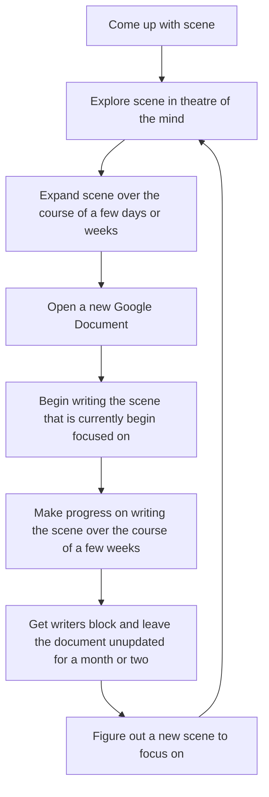

# Flowchart Diagram
 -This diagram is intended to describe the way that I get ideas for the writing that I do, along with the ways that I put the ideas into a document for other people to review and give feedback for.
 -Node A: The manner in which I come up wth scenes is through imagining what some characters are doing and how they interact.
 -Node B: I explore a scene in my mind by following one or more characters through their journey doing whatever it is they are currently doing.
 -Node C: The method that I use to expand the scene that I am focusing on is pretty much continuing to do what I do to explore the scene.
 -Node D: The method of opening a Google Document is relatively self-explanatory, however the method that I use is to open Google Drive, then go over to the "New" button and select a new Google Document.
 -Node E: The way that I start to write my scenes is through putting on some insturmental music that helps me to focus on the scene as I type it out.
 -Node F: This node represents the manner in which I spend a couple of days to a few weeks continuing to write and expand on what I have written.
 -Node G: This node is a representation of how I tend to get writer's block that sticks with my like an obstacle for my writing for a long time.
 -Node H: This node represents how I move from the scene that is presenting me with the writers block to another scene that should not be giving me writer's block.

